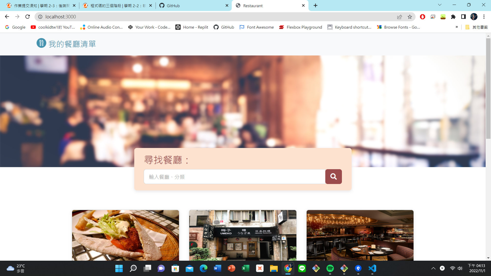

# A1restaurant# 我的餐廳清單



## 介紹

這是我的餐廳清單，可利用搜尋欄輸入關鍵字搜尋，點擊可查看詳細資訊，如想確認地址，可點擊地圖旁三角形圖示。

## 功能

- 查看所有餐廳
- 可參考推薦指數
- 瀏覽餐廳詳細資訊
- 餐廳地址可連結至google地圖
- 搜尋特定餐廳

## 使用說明

1.  請確認是否有安裝 Node.js 及 npm
2.  請下載本專案或是clone至本端
```
git clone https://github.com/RaynaLin/restaurant_list.git
```
3.  安裝完畢後，開啟專案
```
npm run dev
```
4.  若看見此行訊息則代表順利運行，打開瀏覽器進入到以下網址
```
Listening on http://localhost:3000
```
5.  若欲暫停使用
```
ctrl + c
```

## 開發工具

- Node.js 16.17.
- Express 4.18.2
- Express-Handlebars 6.0.6
- Bootstrap 5.2.2
- Font-awesome 5.8.1
